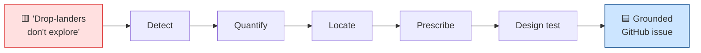
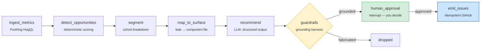

<div align="center">

# 🧭 CRO & Liquidity Advisor Agent

**It figures out your data problems, pinpoints the exact UI element to change to fix them, and helps you run the experiment that proves it worked — with you in the loop at every step.**

*Diagnose → Prescribe → Experiment · grounded in live PostHog data and your real source files · zero hallucinated numbers*

`LangGraph` · `PostHog Query API` · `Groq / Claude` · `Python 3.12`

</div>

---

## What it does, in three moves

> Jhaazi's funnel is fully instrumented in PostHog (~130k events / 14 days). But data isn't insight. This agent closes that gap — on demand, end to end.

### 1️⃣ Finds the data problem
It reads the live buyer funnel and seller-liquidity metrics, and **surfaces exactly where you're leaking** — ranked by how much it costs you. No dashboards to stare at; it tells you *"this is the #1 thing bleeding users, and here's the number."*

### 2️⃣ Pinpoints the element to change
For each leak, it traces the problem to the **exact React component responsible** (e.g. `drop-landing-screen.tsx`) and proposes a **concrete UI/UX change** to fix it — not "improve checkout," but *which screen, what change, why.*

### 3️⃣ Helps you run the experiment — human in the loop
It generates a **launch-ready PostHog experiment** (feature flag, goal metric, sample size) to validate the change, files it as a GitHub issue **only after you approve**, and later **measures whether the metric actually moved** — feeding what works back into its next round of suggestions.

> **You stay in control.** It is an *advisor, not a mutator* — read-only against PostHog, your codebase, and seller data. The only thing it ever writes is a GitHub issue, and only with your approval.

---

## 👀 See it in action

### 🟥 The data problem

> **People land on a drop, but never go to the marketplace. What do we do?**

On Jhaazi, sellers share drop links on Instagram — so thousands of people land **directly on a single drop** and never browse the marketplace to discover other sellers. Every one of them is a buyer who only ever sees one seller's inventory. That's a quiet, expensive liquidity leak.

You can *feel* the problem. Turning it into a shipped fix usually means: an analyst digs through PostHog, eyeballs a funnel, guesses a cause, writes a vague ticket, and someone argues about priority. Days pass.

### 🟩 What the agent does with it — in one run



| Step | The agent's output | Where it came from |
|---|---|---|
| **Detect** | Flags `drop_view → marketplace_view` as the **#1 opportunity** | deterministic scoring (`lost = dropoff × volume`) |
| **Quantify** | **68% of 1,674 drop-landers** never reach the marketplace | live PostHog HogQL query |
| **Locate** | Traces it to `src/features/drops/components/drop-landing-screen.tsx` | hand-authored leak→component map |
| **Prescribe** | *"Add an explore-more-sellers section to the drop landing page"* | LLM, grounded in the actual file |
| **Design test** | PostHog experiment: flag `explore-more-sellers`, goal `jz_marketplace_view`, **932/variant** | structured experiment spec |
| **File it** | One GitHub issue — **only after you approve** | idempotent emit |

### The issue it actually wrote (unedited)

> ### Add explore-more-sellers surfaces to the drop landing page
>
> **Leak** — Users deep-link to a drop from Instagram and never reach the marketplace feed.
>
> **Evidence (from PostHog)** — `dropoff_rate` = **0.6828** · `upstream_volume` = **1674**
>
> **Root-cause hypothesis** — Lack of visibility of other sellers on the drop landing page.
>
> **Proposed change** — Add a section to the drop landing page that showcases other sellers and lets users explore the marketplace.
> **Target file:** `src/features/drops/components/drop-landing-screen.tsx`
>
> **PostHog Experiment (handoff-ready)** — flag `explore-more-sellers` · goal `jz_marketplace_view` · `control` vs `variant` · min sample/variant **932**

**Every number is lifted directly from a PostHog query.** The grounding harness rejects any recommendation that cites a statistic not in the ingested data, or a file that doesn't exist in the repo. And the agent does this for *every* leak in the funnel — claim CTAs, checkout, claim expiry — ranked by impact, in a single run.

---

## How it works



1. **Ingest** — query the live buyer funnel + seller-liquidity metrics over a window.
2. **Detect** — score every step deterministically (`lost = dropoff × upstream_volume`) — *in code, not LLM-vibed.*
3. **Segment** — break the top leaks by cohort (`live` / `scheduled` / `ended` drop) using PostHog's real same-person funnel conversion, so each rec says *where* it's worst.
4. **Map to surface** — a hand-authored funnel-step → component map points the LLM at the actual `.tsx` file responsible.
5. **Recommend** — the LLM produces a *structured* recommendation: leak, cited evidence, root cause, concrete change, experiment spec, effort.
6. **Guardrails** — the grounding harness validates every number and file path. *No grounding, no issue.*
7. **Approve** — a human-in-the-loop pause. Nothing is written until you say yes.
8. **Emit** — one idempotent GitHub issue per recommendation (re-runs never duplicate).

---

## 🛡️ Why you can trust the output (the grounding harness)

The headline risk with an LLM analyst is **confident fabrication**. This agent is engineered against it:

| Guarantee | How |
|---|---|
| **No invented statistics** | Every cited metric must trace to a value in the ingested PostHog dataset, or the recommendation is dropped. |
| **No invented files** | Every referenced path must exist in the repo, verified on disk. |
| **No noise** | A sample-size gate suppresses any "leak" below a minimum volume. |
| **Deterministic priority** | Ranking is `impact × volume ÷ effort`, computed in code — not by the model. |
| **No duplicates** | Stable per-opportunity fingerprints dedupe against already-open issues. |
| **No surprise writes** | Read-only keys + a human-approval `interrupt()` before any GitHub write. |
| **Bounded cost** | Per-run LLM-call and USD cost caps protect against runaway runs. |

---

## What it measures

**Buyer CRO** — the full funnel
`marketplace_view → drop_view → drop_card_select → item_view → claim_attempt → claim_success → checkout_intent → checkout_submit → checkout_created → payment_return → purchase_confirmed`

**Seller liquidity** — `claim_to_paid`, `expired_claim_rate`, `sell_through`, `seller_activation`.

> **🔑 Jhaazi-specific intelligence:** sellers share drop links on Instagram, so most users **land on a drop without ever seeing the marketplace.** The agent treats `drop_view` as a primary entry point and scores **`drop_view → marketplace_view`** (converting drop-landers into multi-seller explorers) as the **#1 cross-sell opportunity** — a growth lever, not a defect.

---

## Capabilities

| Stage | What it adds |
|---|---|
| **Core advisor** | Live funnel + liquidity scoring → grounded, codebase-aware recommendations → human-gated GitHub issues |
| **Cohort segmentation** | Breaks each leak by `drop_status` via PostHog `FunnelsQuery` — *where* the leak is worst |
| **Experiment handoff** | Each rec ships a launch-ready PostHog Experiment spec (flag, goal metric, sample size) |
| **Impact attribution** | Measures whether a shipped experiment actually moved its goal, and annotates the original issue |
| **Weekly digest** | Snapshot + week-over-week **regression detection**, auto-prioritized backlog, Slack digest |
| **Closed loop** | Learns a durable prior over *what kinds of changes move metrics* and feeds it back into generation |

---

## 🤖 Automation (GitHub Actions)

A workflow runs the agent on demand (Actions tab → **Run workflow**) or on a weekly schedule:

| Mode | Does | Writes? |
|---|---|---|
| `print-metrics` | Dumps the live metrics it ingests | nothing |
| `weekly` | Regression digest + prioritized backlog + Slack | nothing (Slack post only) |
| `dry-run` | Full pipeline incl. LLM recommendations | nothing |

Issue emission stays a **human-approved local action** — intentionally never automated in CI.

---

## Quickstart

```bash
python -m venv .venv && source .venv/bin/activate
pip install -e .
cp .env.example .env          # add PostHog personal key, LLM key, GitHub token

python -m cro_agent.run --print-metrics                 # inspect live data
python -m cro_agent.run --dry-run                        # preview recs, writes nothing
python -m cro_agent.run                                  # approve → files GitHub issues
python -m cro_agent.run --dry-run --fixture data/fixtures/sample_metrics.json  # offline
python -m cro_agent.run --weekly                         # regression digest + backlog
pytest                                                    # 31 tests
```

<details>
<summary><b>Configuration (.env)</b></summary>

| Var | Purpose |
|---|---|
| `POSTHOG_HOST` / `POSTHOG_PROJECT_ID` | US production project |
| `POSTHOG_PERSONAL_API_KEY` | **Personal** key (`phx_…`) with `query:read` — not the `phc_` ingest token |
| `LLM_PROVIDER` / `CRO_AGENT_MODEL` | `groq` + `llama-3.3-70b-versatile`, or `anthropic` + a Claude model |
| `GROQ_API_KEY` / `ANTHROPIC_API_KEY` | LLM key for the chosen provider |
| `GITHUB_TOKEN` / `GITHUB_REPO` | token with **Issues: write**; `owner/repo` |
| `JHAAZI_FRONTEND_PATH` | local checkout of `jhaazi-frontend` (file grounding) |

</details>

---

## Architecture

- **`LangGraph` `StateGraph`** with a typed Pydantic state and a `SqliteSaver` checkpointer (durable, resumable, supports the human-approval interrupt).
- **Read-only PostHog Query API** (HogQL + `FunnelsQuery`) for funnel, liquidity, segmentation, and experiment attribution.
- **Provider-agnostic LLM layer** — Groq or Anthropic, structured (JSON-schema) outputs only.
- **Grounding harness** — the validator, sample-size gate, deterministic scorer, and dedupe.
- **31 tests** covering scoring, grounding, segmentation, attribution, regression, dedupe, and the learned prior.

See [`PLAN.md`](PLAN.md) for the full design rationale.
